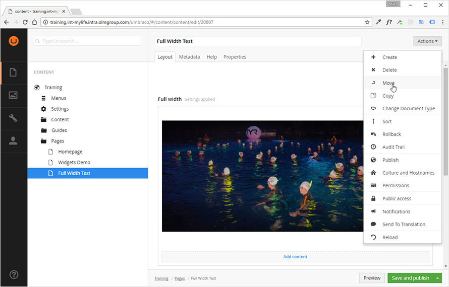
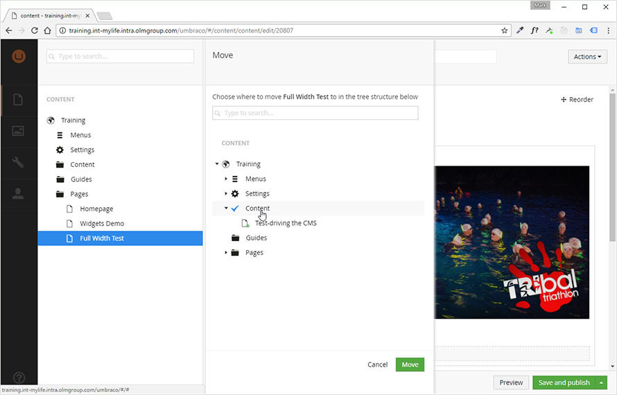
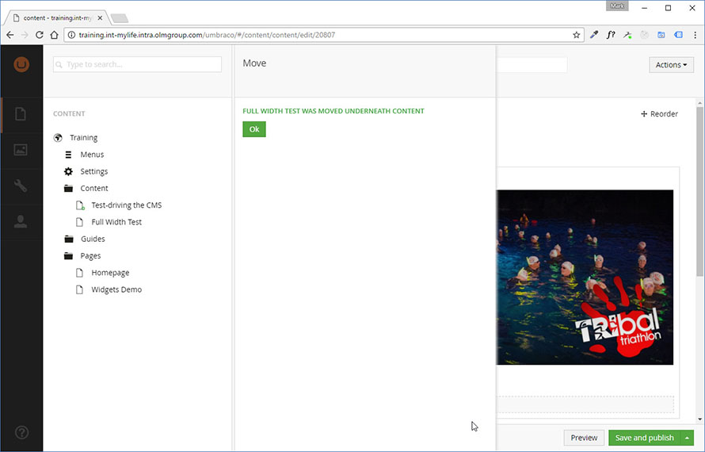

# File Managment

xxx

## Move or Copy a Content Item

### When to move content

You may find yourself wanting to move content into new folders or sub-folders for better site organisation, or because the inheritted breadcrumbs from a folder are inappropriate.

Equally, you may have a great page that you wish to use as a template for creating a new one, and stating from a copy gives you a head start and better consistency.

Move and Copy are easy to use and available on all content items and folders.  You can only move or copy content into a destination folder (i.e. not into another article).  If you are nesting folders then ensure that the destination has been created before you try to move.

### How to move content

* Open the Content View.
* Within your site folder structure, click on the content item that you want to move or copy.
* Select `Move` (or `Copy`) from the actions list at the top right of the page.

* Select the destination folder that you want to move or copy content to.  This is the tree in the middle panel below.  *Note that you can use search to quickly find deeply nested folders by name.*
* Click the `Move` button (bottom of middle panel).

* You will see an `Ok` message when the move or copy is complete.

After copying a content item or page, you should give the new copy a distinct alias and title.