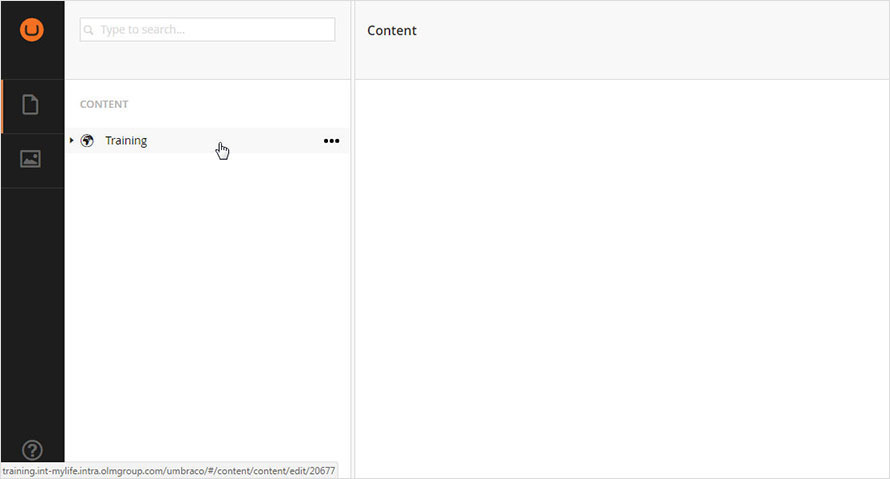
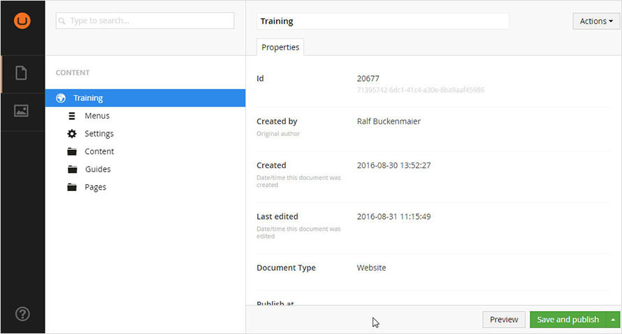
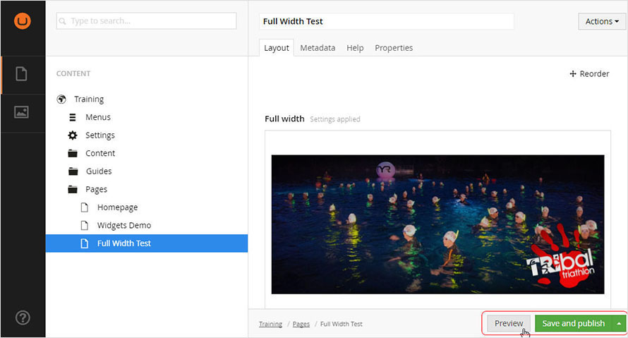

## Overview

This page is intended as a quick primer to find your way around the CMS screen and learn Umbraco conventions.
Other chapters provide more detail in completing tasks.

Your CMS is hosted at the following Urls:

    TEST: https://{your-site}.mylifetest.co.uk/umbraco

    LIVE: (Coming after Beta test period)

## Content

* When you sign in for the first time, the landing page is the `Content` page, showing only your top-level site folder.

* Hovering over the site name will reveal an arrow to the left and an ellipsis to the right.

* Click the arrow to expand the site tree.

## Properties

* Most items that you click on will show a `Properties` panel.

* This panel shows information about the item and cannot be changed.  You can generally ignore properties panels.

## Actions

### Create

* If you click the ellipsis icon (hover over an item to make it appear), then a new `Create` panel will open in the middle part of the screen.

* This panel allows you to create a new item.  It will show a list of all valid things that you can create in this place.  E.g. you can only create new menu links or sub-menus within a `Menu`, but you can create a wide range of items under a `Folder`. 

### Other Actions

* There are two ways to open the `Actions` panel, which gives you a set of other actions for the current selcted item.  The specific actions that you can do depend on the nature of selected item.

* You can click on the `Actions` button, to the top right of the screen.  This will show a drop down list of actions.

* Or you can click the `Do Something Else` button at the bottom of the `Create` panel.  This changes the Create panel to show the same list of actions as the drop down menu.

* To find out more about using actions, please read the `1` section.

## Media

* Click on the bottom icon in the left bar to work with your uploaded media assets (pictures, audio, video and documents).

* Click on a folder to search or view all assets in that folder, or click on the arrow to open up the folder tree and drill down to a specific asset.

* See `` for more information on how to work with media files.

!!! warning
    Although you _can_ store video within the CMS, we do not recommend it.  
    File streaming services like YouTube are optimised for delivering video content quickly to your users' devices and will perform much better.

## Preview and Publish

* Umbraco CMS gives you a good idea of how pages will look as you build with the `Page layout` tools, but you can see a full pre-flight preview by clicking the `Preview` button at the bottom right of most screens.

* Next to the preview button you will find a `Save and publish` button.  Clicking this will publish changes to your site.  Clicking the arrow to the right gives you options to `Save` (a draft) and `Unpublish` content back into draft form.

!!! note
    There is no publishing workflow set up in Umbraco CMS.  You can save files as drafts and preview them prior to publishing. 
