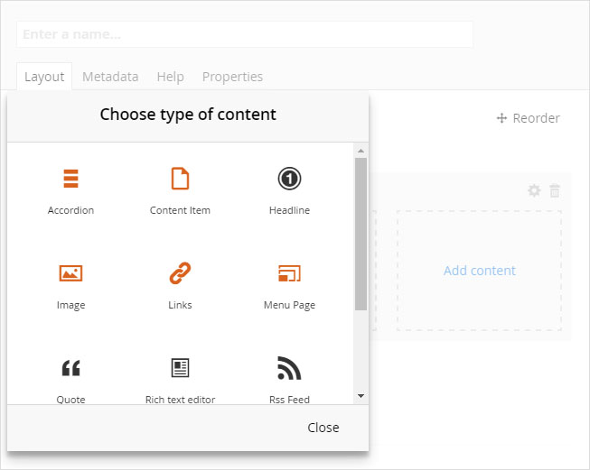

# Content Widgets

`Widgets` are self-contained blocks of content. They are designed to present one type of information and have some intrinsic styles and properties, many of which can be changed with simple settings.

They allow you to create and manage rich elements in a page that would otherwise require developer skills.

## Add a Widget to a Page

You can add or replace a content widget within a page at any time.  Start with an exsiting or new [Page](../page-layout).

* Click on the page that you want to edit to reveal the details panel, or [create a new page](../page-layout/#create-a-new-page) and [add a row](../page-layout/#add-a-row) 
* Click on the `Add content` drop zone in a cell

* A widgets picker dialog will appear; select the type of content widget that you want to add to this cell

See below for more details on the different types of content that you can add and how to change their settings.

## View or Change Widget Settings

This applies to all widgets.  

* To access the settings panel, click on the widget body within a cell

* A blue bar will appear at the top of the widget, with a bin icon

* Click the bin icon to remove the widget
* Or click the widget body once more to display the settings panel
* The rest of this section is dedicated to what the settings do for each type of content widget

## Content Item

A `Content Item` widget simply contains any `HTML Content` page that you have already created. You can read more about building [content articles here](../content-articles).

When you add a `Content Item` into a cell, the side panel will show a [link picker](../content-articles/#links-picker) to find the article that you want to embed in the current page.

When you click a `Content Item` to edit it, there is no settings panel. Instead, you can edit the content directly in the cell (see figure below).

Click `Save` or `Save and publish` when you are finished to store the changes.

## Image

Follow the standard process to [show widget settings](#view-or-change-widget-settings)

Images have the following settings that you can adjust:

!!! warning
    TODO - add info about aspect ratio clipping

|Setting|Description|
| ------------- | ------------- |
|Image|A [media picker](../content-articles/#media-picker)  to search for an existing - or upload a new - picture.|
|Dimensions|Select the closest aspect ratio for the picture that you want to use. Aspet ratio is relative width x height.|
|Short description|This text will fill in the `Alt` tag in the image and is important for screen readers and accessibilty.|
|Long description|Also for accessibilty; if the picture conveys visual detail, e.g. an infographic, then you _should_ supply a textual narrative to explain the same detail to a visually impaired user.  This text will not appear on screen; it can only be picked up by screen reading software.|
|Caption text|An optional caption. Will be displayed above the image in white text.|
|Caption size|Heading size 1 - 6. We recommend that you do not use H1 unless it is the only H1 heading on the page.|
|Caption position|Select from a list of 9 positions for the caption, top-bottom and left-right.|
|Caption padding|Type in an optional amount of padding (_padding-sm_, _padding-md_, _padding-lg_) that you want to appear around the caption.|
|Caption overlay|This applies a dark overlay to the image to improve contrast of the text. Overlay options are shown below this table.|
|Custom styling|An optional class name or names, separated by spaces. If any of these names match styles in your site theme then those styles will be applied to the image.|

### Overlay Options

Sometimes the image that you choose is too bright for the caption text to stand out.  We have provided 3 utility styles to add darker overlays, or scrims.  To use one, type the style name into the `Caption overlay` textbox.

|(default)|tint|ceiling-fade|floor-fade|
| --- | --- | --- | --- |
|||||

* __tint__ = a uniform 20% darker overlay across the whole picture
* __ceiling-fade__ = a gradient which is darker at the top, for top-positioned captions
* __floor-fade__ = a gradient which is darker at the bottom, for bottom-positioned captions

## Video

You can embed videos that are hosted on a public streaming service (YouTube and Vimeo are supported out of the box). We use responsive embedding, so the video will resize according to the user's device.

Follow the standard process to [show widget settings](#view-or-change-widget-settings)

`Videos` have the following settings that you can adjust:

|Setting|Description|
| ------------- | ------------- |
|Video url|The hyperlink to a hosted video on a public streaming service. The link that you need is the _Embed_ link, which has the form `https://www.youtube.com/embed/XXXXXXXXXX`, where the Xs are replaced with your video code.|
|Aspect ratio|Select 16x9 for widescreen videos and 4x3 for 1970s television format.|
|Short description|This text will be found by screen readers.|
|Long description|Also for accessibilty; if the video conveys visual detail without audio, then you _should_ supply a textual narrative to explain the same detail to a visually impaired user.  This text will not appear on screen; it can only be picked up by screen reading software.|
|Caption|An optional caption. Will be displayed above or below the video.|
|Caption styling|Type in an optional amount of padding (_padding-sm_, _padding-md_, _padding-lg_) that you want to appear around the caption.|
|Custom styling|An optional class name or names, separated by spaces. If any of these names match styles in your site theme then those styles will be applied to the image.|

## Links

!!! warning
    TODO - update this section when Links allow users to pick an existing menu

Follow the standard process to [show widget settings](#view-or-change-widget-settings).

`Links` have the following settings that you can adjust:

|Setting|Description|
| ------------- | ------------- |
|Title|A heading to display above the collection of links.|
|Title size|Select a heading size from H1 - H6. Note: you should not have more than one H1 on a page, so it is unlikely that you will use this value.|
|Columns|Select the number of columns of links that you want to display in the section, from 1 - 6.|
|Order|Select whether you want to populate the columns left-to-right, or top-to-bottom.|
|Custom style|An optional class name or names, separated by spaces. If any of these names match styles in your site theme then those styles will be applied to the image.|
|Items|A collection of link items (see details in table below).|

### Link Items

|Setting|Description|
| ------------- | ------------- |
|Text|The anchor text displayed on screen.|
|Link|The hyperlink that a user will open when they click the link. This uses a [link picker](../content-articles/#links-picker) to type a relative or absolute Url, or select an existing content item.  It also contains a checkbox to open the link in a new window (recommended for external links).|
|Title text|Text that will be rendered in the `title` tag. This is read by screen readers and is essential for accessibility.|
|Sub items|An optional collection of link items nested below the current link. You can have two levels of depth in this widget.|

## Menu Panel

The `Menu Panel` widget embeds a collection of visual links into the page. It offers the same settings that you have when building a standalone `Menu Panel Page`.

Follow the standard process to [show widget settings](#view-or-change-widget-settings).

Please follow this link to find details on [Menu Panel settings](../menu-pages).

## Accordion

An `Accordion` is a piece of content with collapsable rows, often used for FAQs or sections where the user wants to reveal information on specific topics. Each row has a title and rich content that gets revealed when the title is clicked and hidden when the title is clicked again.

Follow the standard process to [show widget settings](#view-or-change-widget-settings).

`Accordions` have the following settings that you can adjust:

|Setting|Description|
| ------------- | ------------- |
|Title|_Not used_|
|Headline|The main heading above the whole accordion block.|
|Headline weight|Select a heading size from H1 - H6. Note: you should not have more than one H1 on a page, so it is unlikely that you will use this value.|
|Accordion items|A collection of accordion items, described in the table below.|

### Accordion Items

|Setting|Description|
| ------------- | ------------- |
|Heading|The text displayed in the header; always visible on screen.|
|Body|The information that is revealed when the accordion is open.  This uses a rich content editor, so you can create any piece of [HTML Content](../content-articles).|
|Is the panel open by default|Toggle whether you want this section open when the page is loaded.|

## Carousel

xxx

## Grid (2x2)

XXX

Follow the standard process to [show widget settings](#view-or-change-widget-settings).

`Grids` have the following settings that you can adjust:

|Setting|Description|
| ------------- | ------------- |
|Title|An optional heading displayed above the grid.|
|Grid style|An optional class name or names, separated by spaces and applied to the whole grid. If any of these names match styles in your site theme then those styles will be applied to the grid.|
|Section style|An optional class name or names, separated by spaces and applied to each cell within the grid. If any of these names match styles in your site theme then those styles will be applied to each cell.|
|Left-hand column width|Select a proportion from the list, given in 1/12th increments, expressed as percentages. The total width of left + right must equal 12.|
|Right-hand column width|Select a proportion from the list, given in 1/12th increments, expressed as percentages. The total width of left + right must equal 12.|
|Rows|A collection of row items (see table below).|

### Row Items Settings

The following settings are repeated for both left and right hand sides of each row. Having selected the appropriate type for each side, you only need to compelte the relevant section for image, video or content.

|Setting|Description|
| ------------- | ------------- |
|Type|Select whether this side will display an image, a video or HTML Content|
|Image|A media picker to select or upload an image.|
|Image description (short)|This text will fill in the `Alt` tag in the image and is important for screen readers and accessibilty.|
|Image description (long)|Also for accessibilty; if the picture conveys visual detail, e.g. an infographic, then you _should_ supply a textual narrative to explain the same detail to a visually impaired user.  This text will not appear on screen; it can only be picked up by screen reading software.|
|Video url|The hyperlink to a hosted video on a public streaming service. The link that you need is the _Embed_ link, which has the form `https://www.youtube.com/embed/XXXXXXXXXX`, where the Xs are replaced with your video code.|
|Aspect ratio|Select 16x9 for widescreen videos and 4x3 for 1970s television format.|
|Video description (short)|This text will be found by screen readers.|
|Video description (long)|Also for accessibilty; if the video conveys visual detail without audio, then you _should_ supply a textual narrative to explain the same detail to a visually impaired user.  This text will not appear on screen; it can only be picked up by screen reading software.|
|Content|A content article. This uses a rich content editor, so you can create any piece of [HTML Content](../content-articles).|

## Search Categories

x

Follow the standard process to [show widget settings](#view-or-change-widget-settings).

`Search Categories` has the following settings that you can adjust:

## Twitter Feed

Follow the standard process to [show widget settings](#view-or-change-widget-settings).

`Twitter Feeds` have the following settings that you can adjust:

## RSS Feed

Follow the standard process to [show widget settings](#view-or-change-widget-settings).

`RSS Feeds` have the following settings that you can adjust:

## Block Quote

XXXXXXXXXX
